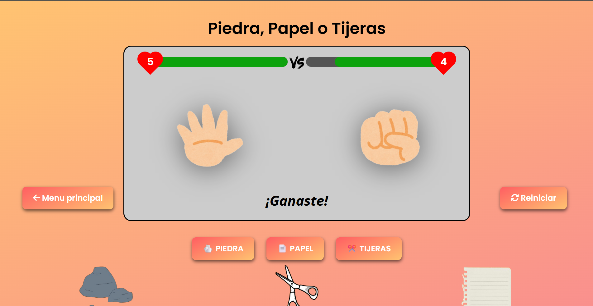

# ✊🖐✌ Juego de Piedra, Papel o Tijera

¡Bienvenid@ al clásico juego de **Piedra, Papel o Tijera**, reinventado con un toque moderno!  
Este proyecto fue realizado por varios estudiantes como práctica de programación y diseño web.

---

  

## 🎮 ¿De qué trata este proyecto?

Es una versión interactiva del juego de toda la vida: **Piedra vs Papel vs Tijera**, donde puedes jugar contra la computadora.  
Se trabajó tanto en el diseño visual como en la lógica del juego para hacerlo atractivo, funcional y adaptable.

---

## 🧠 Tecnologías utilizadas

- **HTML5** — para estructurar la página.
- **CSS3** — para los estilos y animaciones.
- **JavaScript** — para la lógica del juego.

---

## 💡 Características principales

✅ Interfaz visual moderna y animada  
✅ Efectos de hover, animaciones y botón "alegre"  
✅ Lógica de juego funcional contra la máquina  
✅ Código limpio, comentado y fácil de entender  
✅ Compatible con computadoras y móviles

---

## 👥 Colaboradores

Este proyecto fue desarrollado en equipo por estudiantes con mucho entusiasmo:  

- [Maik // Chriss]  
- [Euge // Euge]  

---